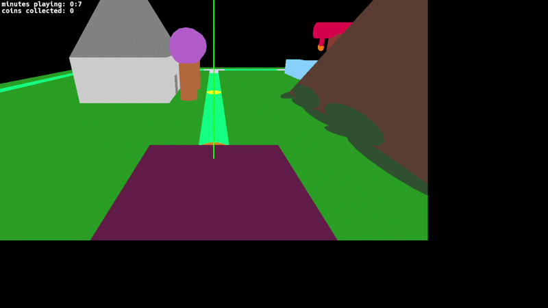
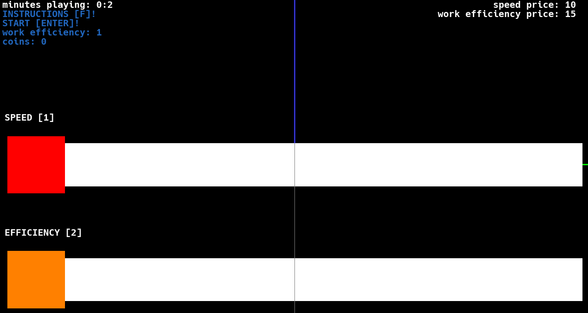

# 🚂 3D Train Simulator

Un simulator 3D în care gestionezi un tren și îndeplinești task-uri pentru a colecta materiale de la diferite stații/cariere.

---

## 🎥 Demo

  

---

## 🖼️ Screenshot

  

---

## 🎮 Gameplay

Te poți deplasa cu trenul folosind tastele:

- **W** – Nord  
- **D** – Est  
- **A** – Vest  

De la gară poți lua un **task** care implică colectarea unor componente de la 3 stații diferite.

---

## 🛠️ Mecanici de joc

- Ai un **număr limitat de workers** care pot colecta materiale simultan  
- Workers pot fi **upgradați** folosind punctele colectate  
- După completarea unui task, începe un **wave nou** cu un număr random de materiale de colectat  

---

## Obiectiv

1. Preia un task de la gară  
2. Colectează materialele de la stații/cariere  
3. Fa upgrade la numărul de workers pentru a finaliza task-ul rapid  
4. Fiecare task completat aduce puncte pentru upgrade 

---

## 🛠️ Tehnologii folosite

- OpenGL  
- 3D rendering custom  
- C++ 

---
